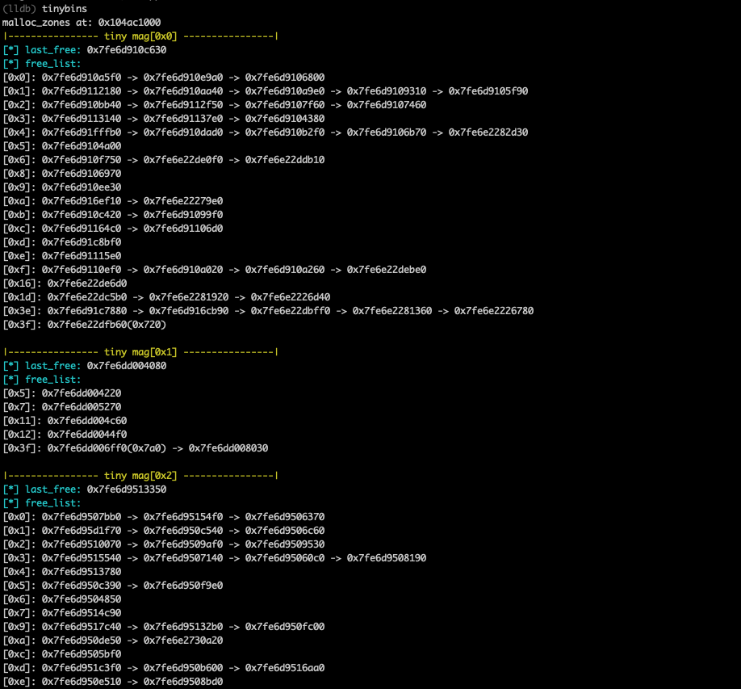

# mHeap

This is a simple lldb plugin designed to inspect heap information in libmalloc on macOS. It is still under development...

As there has been no tool available on macOS to view global heap information (tools like malloc_history only show the history of individual chunk malloc and free operations), mHeap was developed. Understanding the overall heap status is crucial, especially when dealing with applications in pwn macOS.

(Written in 2022, have tested on macOS 13)

## Install

```shell
pip install libnum
```

Add the following code to .lldbinit:

```
command script import ~/mHeap/mheap.py
```


## Commands

* tinybins

Outputs information about the last free and free list of the current tiny heap.



* smallbins

Functions similarly to `tinybins`, providing information about the last free and free list of the small heap. 

The current version may have issues and the information provided might be inaccurate.

## TODO

- [ ] Support for the small heap
- [ ] Support for the nano heap
- [ ] Support for the large heap